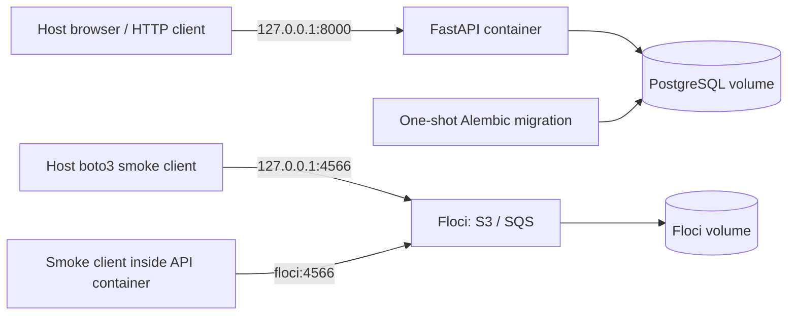

# Architecture and Milestone 1 decisions



The task API does not use S3/SQS yet. The smoke clients establish verified emulator connectivity before task exports arrive in Milestone 5. Floci availability does not determine the task API's readiness.

## Ownership

| Component | Owns now | Planned later |
| --- | --- | --- |
| `previewforge-demo/` | API source, migrations, seed data, tests, Dockerfile | Worker and application-image CI |
| Platform repository root | Compose startup, local acceptance scripts, design and results | kind, Helm, GitOps, Terraform, observability, AI service |
| PostgreSQL | Real persisted synthetic task records | Separate instance/storage per environment |
| Floci | Simulated S3 objects and SQS messages | Per-environment Terraform resources |

There is one remote repository. Keeping the logical demo component inside this checkout avoids an untracked sibling dependency. Before Milestone 3, review whether to split that component into a separately authorized application repository. Deployment-config changes must not trigger application-image rebuilds.

## Database and health

SQLAlchemy uses PostgreSQL through psycopg. Alembic creates the schema in a separate, one-shot service; the API starts after that service succeeds. The application does not silently create tables itself. This follows [Compose's dependency health/completion controls](https://docs.docker.com/compose/how-tos/startup-order/) and leaves migrations usable as a later deployment Job.

Liveness answers whether the process can respond. Readiness checks both database connectivity and the task table. A database failure returns a sanitized HTTP 503 for readiness/task requests, while liveness, version and metrics remain available. Database connections and statements have bounded timeouts.

PostgreSQL stores records in a project-scoped named Docker volume. Replacing the API container or stopping the stack retains records. Integration tests use a separate `test-db` container with a disposable memory-backed database, never the interactive demo database. The seed command inserts deterministic synthetic rows without overwriting edits.

## Credentials and local access

The startup wrapper creates random database credentials outside tracked and synced files. The API and PostgreSQL read a mounted password file; the password is absent from Compose YAML, environment values, command-line arguments and logs. [Compose secrets](https://docs.docker.com/compose/how-tos/use-secrets/) are local mounted files, not an external secret manager.

The Floci SDK factory explicitly sets dummy credentials, region, endpoint, path-style S3 addressing and bounded retries. It ignores ambient AWS profiles/configuration and proxy settings. Missing, public or unapproved endpoint URLs are rejected before creating clients. No real AWS account is needed.

Floci advertises `http://floci:4566` in queue URLs. That hostname works inside Compose; host clients validate the returned origin and exact smoke queue identity, then substitute the configured loopback origin. This tests queue identity and reachability without relying on public wildcard DNS or editing the host's hosts file. Kubernetes endpoint routing remains unimplemented until kind is introduced.

Floci gets no Docker socket: the S3/SQS operations used here do not require it. Named volumes are isolated to the selected Compose project. API and Floci ports bind only to `127.0.0.1`.

## Telemetry and identity

Application requests produce JSON logs with generated request ID, HTTP method, route template, status and duration. Logs omit request bodies, raw paths, query strings, headers and database exception contents. Metrics use bounded route/method labels; task UUIDs and arbitrary request paths do not become time-series labels.

`/version` and `previewforge_build_info` show the source SHA and environment. Startup uses the current checkout commit; a checkout with modifications is labeled `<sha>-dirty`. Before the first local commit, the source is labeled `local-uncommitted`. The acceptance script compares the expected identity with the running API before and after recreation/recovery. Later CI will supply the exact immutable build identity.

Only the Prometheus text endpoint exists now. No Prometheus server, Grafana dashboard or Kubernetes rollout has been tested in Milestone 1.

## Dependency sources and update procedure

- [Floci 2.0.1 configuration](https://github.com/floci-io/floci/blob/2.0.1/docs/configuration/environment-variables.md), [S3](https://github.com/floci-io/floci/blob/2.0.1/docs/services/s3.md), [SQS](https://github.com/floci-io/floci/blob/2.0.1/docs/services/sqs.md).
- [FastAPI container guide](https://fastapi.tiangolo.com/deployment/docker/).
- [Alembic migrations](https://alembic.sqlalchemy.org/en/latest/tutorial.html).
- [boto3 configuration](https://docs.aws.amazon.com/boto3/latest/guide/configuration.html).

Compose and Dockerfile pin tested image digests. `pyproject.toml` pins direct packages; `requirements.lock` and `requirements-test.lock` lock transitive packages and hashes for Python 3.12 on Windows/Linux. They were generated with uv 0.12.12:

```powershell
# From previewforge-demo/, using an isolated uv 0.12.12 installation.
uv pip compile pyproject.toml --universal --generate-hashes --output-file requirements.lock
uv pip compile pyproject.toml --extra test --universal --generate-hashes --output-file requirements-test.lock
```

Update explicit versions/digests intentionally, regenerate both locks, then rerun the documented full verification and update the results report.
