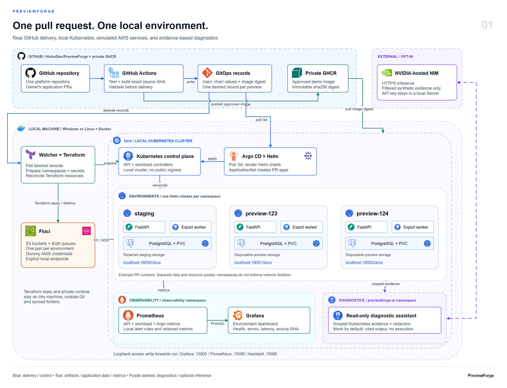
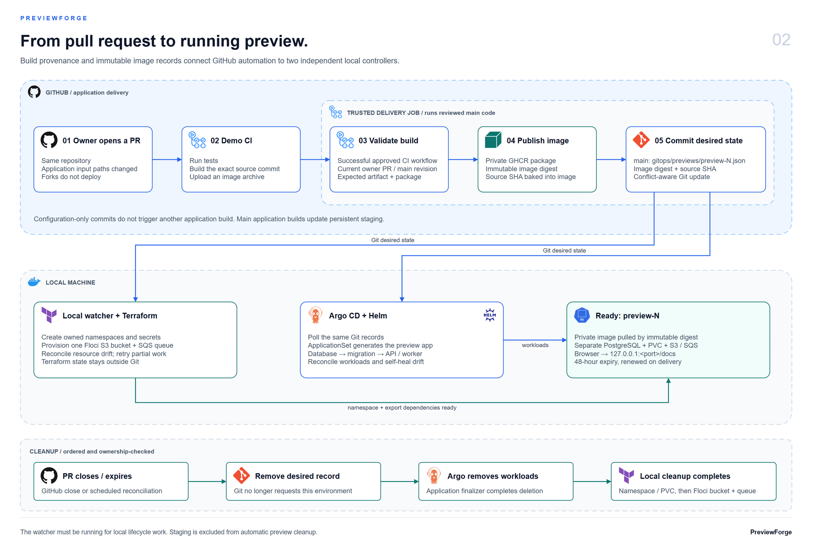
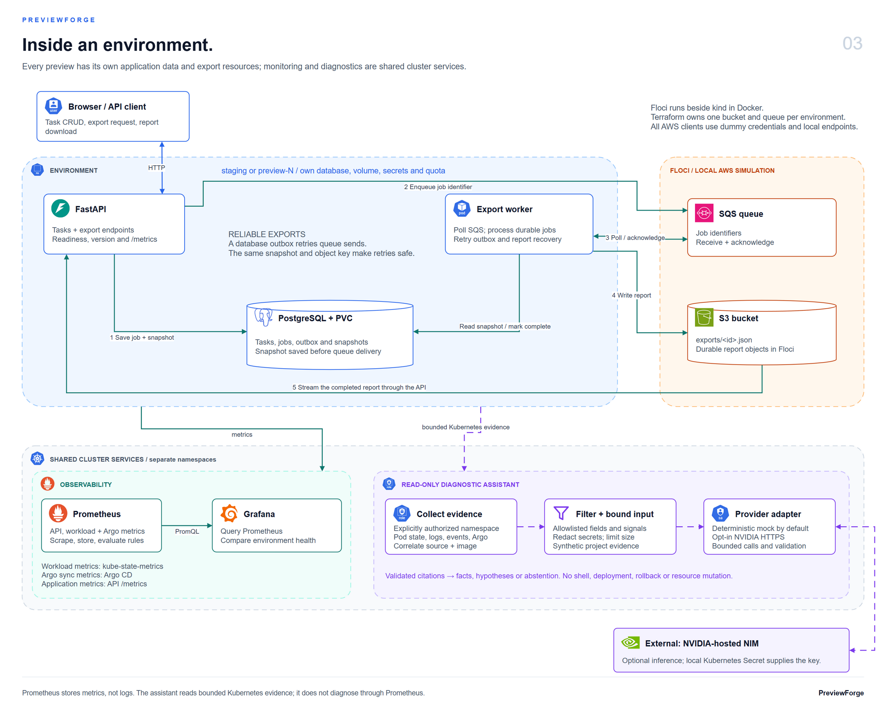

# Architecture and implementation decisions

## Current platform overview



[Edit the draw.io source](diagrams/previewforge-architecture.drawio) · [Download the three-page PDF](diagrams/previewforge-architecture.pdf) · [Open the overview PNG](diagrams/previewforge-architecture-overview.png)

The three PNG previews on this page are the latest draw.io exports, in the same order as the PDF: platform overview, PR delivery and cleanup, and application runtime with exports and diagnostics. The native document includes technology logos and Kubernetes/AWS resource symbols; shapes, labels, groups and connectors are editable. See the [diagram index, reusable symbol library and export commands](diagrams/README.md).

The diagrams show the configured GitHub delivery mode across all six milestones. Source repository visibility can be private or public; the GHCR package stays private. PR numbers 123 and 124 are examples; their URLs require active local port-forwards. Floci runs beside kind in Docker. The local watcher owns Terraform and namespace preparation; Argo CD owns workload reconciliation. Hosted NVIDIA inference requires explicit opt-in; mock mode is the default. The diagrams describe the architecture, not additional test results or production isolation guarantees.

### PR delivery and cleanup diagram



### Runtime, exports and diagnostics diagram



## Original Compose baseline

The original Compose baseline keeps exports disabled. The configured Kubernetes installation now uses S3/SQS for task exports. With exports enabled, API readiness includes the database, report bucket and queue. See [the export sequence and controller ownership](resources.md).

## Ownership

| Component | Owns now | Planned later |
| --- | --- | --- |
| `previewforge-demo/` | API, export worker, migrations, seed data, tests, Dockerfile | Application extensions |
| Platform repository root | Compose, kind, Helm, Argo, GitHub/GHCR delivery, local Terraform reconciliation, monitoring, diagnostic assistant, acceptance evidence | Platform extensions |
| PostgreSQL | Separate storage, tasks, export jobs and durable report snapshots per environment | Application extensions |
| Floci | Terraform-managed S3 buckets and SQS queues per environment | Additional emulated services if needed |

There is one remote repository. The logical demo component remains inside this checkout. No additional remote was created; a later split would require discussion. Path-filtered CI separates application builds from deployment-config changes.

## Database and health

SQLAlchemy uses PostgreSQL through psycopg. In Compose, Alembic creates the schema in a separate, one-shot service; the API starts after that service succeeds. The application does not silently create tables itself. This follows [Compose's dependency health/completion controls](https://docs.docker.com/compose/how-tos/startup-order/). In Kubernetes, the chart runs Alembic as a migration Job before API/worker rollout.

Liveness answers whether the process can respond. Readiness checks database connectivity and the task table; when exports are enabled it also checks export storage and the queue. A dependency failure returns a sanitized HTTP 503 for affected requests, while liveness, version and metrics remain available. Database and AWS client calls have bounded timeouts.

Compose PostgreSQL stores records in a project-scoped named Docker volume; Kubernetes environments use separate PVCs. Replacing an API container or stopping the retained stack preserves records. Integration tests use a separate `test-db` container with a disposable memory-backed database, never the interactive demo database. The seed command inserts deterministic synthetic rows without overwriting edits.

## Credentials and local access

The startup wrapper creates random database credentials outside tracked and synced files. The API and PostgreSQL read a mounted password file; the password is absent from Compose YAML, environment values, command-line arguments and logs. [Compose secrets](https://docs.docker.com/compose/how-tos/use-secrets/) are local mounted files, not an external secret manager.

The Floci SDK factory explicitly sets dummy credentials, region, endpoint, path-style S3 addressing and bounded retries. It ignores ambient AWS profiles/configuration and proxy settings. Missing, public or unapproved endpoint URLs are rejected before creating clients. No real AWS account is needed.

Floci advertises `http://floci:4566` in queue URLs. Clients validate the local origin and queue identity, then substitute their configured endpoint. The local reconciler connects the existing Floci container to kind's Docker network and maintains a private Kubernetes Service/EndpointSlice from its discovered address. Pods use stable cluster DNS. This needs no public wildcard DNS, hosts-file edits or competing emulator.

Floci gets no Docker socket: the S3/SQS operations used here do not require it. Named volumes are isolated to the selected Compose project. API and Floci ports bind only to `127.0.0.1`.

## Telemetry and identity

Application requests produce JSON logs with generated request ID, HTTP method, route template, status and duration. Logs omit request bodies, raw paths, query strings, headers and database exception contents. Metrics use bounded route/method labels; task UUIDs and arbitrary request paths do not become time-series labels.

`/version` and `previewforge_build_info` show the source SHA and environment. Compose startup labels local modifications as `<sha>-dirty`. GitHub CI bakes the exact source commit into each image, and deployment records select an immutable digest. Acceptance checks compare the intended identity with the running API.

Milestone 1 supplied the metrics endpoint. Milestone 4 added the tested Prometheus/Grafana installation, dashboard and controlled alert/recovery exercises; see [monitoring](observability.md).

## Milestone 2: Git drives persistent staging

The two local commits have different purposes: the source commit identifies the bytes built into the image; the configuration commit selects that image by its imported containerd manifest digest. `/version` reads the source SHA baked into the image. Argo CD owns application reconciliation, including automatic repair of live drift; bootstrap does not run `helm install` for the demo or compete with Argo for its workloads.

The chart orders database readiness, schema migration and API rollout. Staging has its own real PostgreSQL instance, synthetic records, resource quota and retained volume. Ordinary application deletion preserves staging; deleting the kind node still removes its local storage, so retention is not a backup.

The local Git fixture demonstrates actual Argo reconciliation without publishing images or installing GitHub credentials in the cluster. It is not a tested GitHub-to-preview workflow. See [Milestone 2 operation and limitations](kubernetes.md) for exact commands and ownership boundaries.

## PR delivery and cleanup

Milestone 3 extends the staging chart with explicitly disposable preview storage and idempotent synthetic seeds. A Git file ApplicationSet generates an application only from a successful build record. The local reconciler owns namespaces and secrets; Argo owns application workloads and PVCs. Argo's deletion finalizer and a separate ownership/UID-checked namespace cleanup complete the preview lifecycle.

The existing remote contains both logical components. CI builds only when application input paths change; a deployment-record commit does not trigger another build. Trusted default-branch delivery code validates build provenance and live PR/main state, then updates selected Git records with conflict-aware retries. Forks do not deploy. Private GitHub/GHCR delivery has been approved and verified; [remote operation](remote.md) documents startup and credentials.

## Read-only diagnostics

Milestone 6 adds an independent trusted assistant in `previewforge-ai`. Argo CD owns its Helm-rendered ServiceAccount, Deployment and ClusterIP Service. The local setup command owns its explicit environment policy, namespace-scoped read Roles/Bindings and private credential provisioning. The assistant uses the projected read-only service identity, not the bootstrap's administrator kubeconfig. A request verifies the registered source/image, collects selected evidence, filters it, then uses mock inference or explicitly enabled NVIDIA HTTPS inference. It validates citations and structured output without executing any result. See [diagnostics, privacy and live setup](assistant.md).

## Dependency sources and update procedure

- [Floci 2.0.1 configuration](https://github.com/floci-io/floci/blob/2.0.1/docs/configuration/environment-variables.md), [S3](https://github.com/floci-io/floci/blob/2.0.1/docs/services/s3.md), [SQS](https://github.com/floci-io/floci/blob/2.0.1/docs/services/sqs.md).
- [FastAPI container guide](https://fastapi.tiangolo.com/deployment/docker/).
- [Alembic migrations](https://alembic.sqlalchemy.org/en/latest/tutorial.html).
- [boto3 configuration](https://docs.aws.amazon.com/boto3/latest/guide/configuration.html).

Compose and Dockerfile pin tested image digests. `pyproject.toml` pins direct packages; `requirements.lock` and `requirements-test.lock` lock transitive packages and hashes for Python 3.12 on Windows/Linux. They were generated with uv 0.12.12:

```text
# From previewforge-demo/, using an isolated uv 0.12.12 installation.
uv pip compile pyproject.toml --universal --generate-hashes --output-file requirements.lock
uv pip compile pyproject.toml --extra test --universal --generate-hashes --output-file requirements-test.lock
```

Update explicit versions/digests intentionally, regenerate both locks, then rerun the documented full verification and update the results report.
