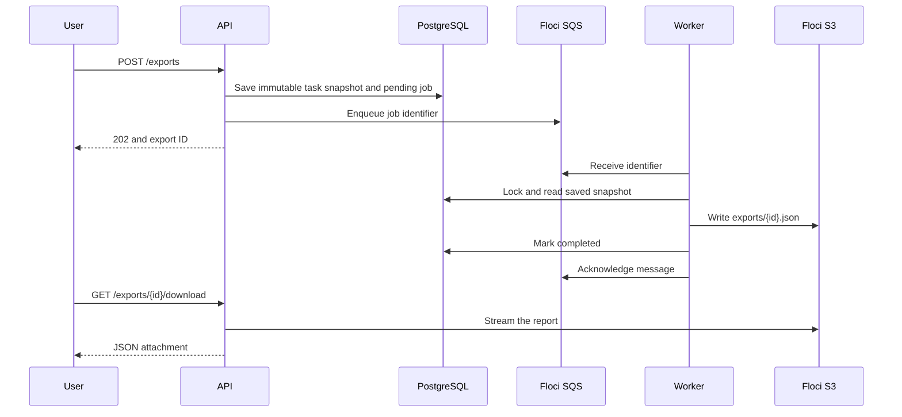

# Local resources and asynchronous exports

Milestone 5 gives staging and each PR preview their own Floci S3 bucket and SQS queue. Terraform creates them; the local watcher reads the existing Git desired records and reconciles the resources. Helm deploys a worker alongside each API and database.

An export follows this path:



The committed pending row is an outbox: if sending to SQS fails, the worker retries it. A crash after uploading is safe because retries use the same snapshot and object key. Reports describe tasks when the request was accepted. The demo limits a report to 10,000 tasks and 4 MiB. An optional UUID `Idempotency-Key` header lets an HTTP retry reuse its original export ID.

## Start the configured laptop

Requires the existing GitHub-mode setup, Windows Python 3.12, running Docker Desktop, Git, and `gh` with **HickoDev active**. Registry pulls use the privately configured read-only credential. Do not paste credentials into chat or files in this checkout. Isolated application CI tests require Docker Compose 2.24.4+ (`!reset` support); Compose 5 works.

Stop an existing watcher with Ctrl+C before setup, then run these from the PreviewForge folder:

```powershell
python scripts/resources.py up --github
python scripts/previews.py watch --github --apply
```

Keep the watcher running. `up` installs checksum-pinned Terraform and hashed Python dependencies into `%LOCALAPPDATA%\PreviewForge\tools\milestone5`, resumes the retained cluster and shared persistent Floci container, discovers Floci's Docker network address, and refreshes the private Kubernetes route. It provisions resources before waiting for export readiness and enabling the tracked `gitops/export-values.yaml` overlay on the configured Argo applications. Earlier local fixture workflows keep exports disabled. The watcher automatically uses this integration once enabled. Use this startup command after Milestone 5: the older `platform.ps1 start` waits for API readiness before it can repair missing export dependencies.

In another terminal:

```powershell
python scripts/resources.py status --github
powershell -NoProfile -ExecutionPolicy Bypass -File .\scripts\platform.ps1 forward
```

`status` can run alongside the watcher. To inspect Terraform's plan, stop the watcher, run `python scripts/resources.py plan --github --environment staging`, then restart it. Planning shares the operation lock with setup/reconciliation.

Open http://127.0.0.1:18000/docs. From another terminal, request and download a report:

```powershell
$reportJob = Invoke-RestMethod -Method Post -Uri http://127.0.0.1:18000/exports -ContentType application/json -Body '{}'
$reportDeadline = (Get-Date).AddSeconds(60)
do {
    Start-Sleep -Seconds 1
    $reportStatus = Invoke-RestMethod "http://127.0.0.1:18000/exports/$($reportJob.id)"
} while ($reportStatus.status -ne 'completed' -and (Get-Date) -lt $reportDeadline)
if ($reportStatus.status -ne 'completed') { throw 'Export is still pending; check the worker and resource status.' }
$reportFile = Join-Path $env:TEMP "previewforge-report-$($reportJob.id).json"
Invoke-WebRequest "http://127.0.0.1:18000/exports/$($reportJob.id)/download" -UseBasicParsing -OutFile $reportFile
$reportFile
```

For two active PRs, use separate terminals and ports (replace the PR numbers):

```powershell
python scripts/previews.py forward --github --pr 123 --port 18051
python scripts/previews.py forward --github --pr 124 --port 18052
```

Their documentation URLs are `http://127.0.0.1:18051/docs` and `http://127.0.0.1:18052/docs`. Each API uses its own database, bucket and queue. The URLs work while the forwards, cluster, Floci and laptop are running. Ctrl+C stops each forward or watcher.

## State, cleanup and recovery

Terraform state, locks, logs and installation identity live outside Git, OneDrive and Floci's volume:

```text
%LOCALAPPDATA%\PreviewForge\runtime\previewforge-m5\
  installation.json
  environments\staging\terraform.tfstate
  environments\preview-123\terraform.tfstate
  environments\preview-124\terraform.tfstate
```

Every bucket and queue carries project, environment and installation ownership tags. The controller checks these through boto3 before planning or importing. It rejects other resources, conflicting ownership, unexpected state addresses, nonlocal endpoints and implicit replacement/deletion. Automatic destroy is restricted to owned previews whose desired records and workloads have been removed, including closed or expired previews; staging is excluded. Preserve this runtime directory: losing its installation identity requires review, since the controller will refuse to adopt resources it cannot identify.

The AWS provider is pinned to **6.9.0** for local URL import compatibility. We tested 6.64.0 and found that its queue importer requires an AWS-shaped HTTPS URL, including when importing by identity. Keeping the compatible provider lets state recovery use the same explicit Floci URLs as ordinary operations. Windows and Linux package checksums are committed in Terraform's lock file; version upgrades must pass the full import/recovery test.

On PR close, GitHub removes the desired record; Argo removes its workloads. The local watcher removes the owned namespace and waits for its storage to disappear, then destroys the bucket and queue. Partial cleanup retains state and retries on the next pass. Staging is never part of automatic preview cleanup. If the laptop was off, start it with the commands above; Git is still the source of desired previews.

After a Floci restart, run `python scripts/resources.py up --github` again. Its volume normally preserves objects and queues. If owned resources disappeared, Terraform refresh detects the loss and recreates them. The worker periodically checks completed reports and reconstructs missing objects from PostgreSQL snapshots. This is eventual recovery: readiness/download requests can fail while resources or reports are being restored. Liveness stays independent of those dependencies.

Floci is shared with Milestone 1 (`previewforge-m1-floci-1`, volume `previewforge-m1_floci-data`). Stopping Milestone 1 also stops Floci and interrupts exports. Do not remove that volume to test recovery. The verification exercise resets only one disposable preview's resources and separately tests a persistent emulator restart.

All AWS clients use dummy `test` credentials and explicit local endpoints. Host Terraform uses `http://127.0.0.1:4566`; pods use `http://floci.previewforge-system.svc.cluster.local:4566`. Services are local. These tests demonstrate Floci API behavior and application isolation, not AWS IAM enforcement, Kubernetes network isolation or production availability. Real AWS, EKS and NVIDIA inference are outside this milestone.

## Verification

```powershell
python scripts/ci.py test
python -m unittest discover -s tests/platform -v
python scripts/resources.py verify --github --allow-faults --allow-github-writes
python scripts/verify_resources_startup.py --allow-faults
```

The PR verification command creates two temporary real PRs, triggers private image publication, updates one PR, introduces bounded faults, and closes/deletes only its own acceptance artifacts. Stop the normal watcher first; verification uses the same operation lock. Existing staging tasks are preserved. Results and recovery journals stay in the private M5 runtime. If the PR exercise is interrupted:

```powershell
python scripts/resources.py recover --github --allow-github-writes
```

The startup check stops only the retained PreviewForge kind node and Floci container, runs the documented `resources.py up --github` command, and checks the API, saved report, tasks, container identities and PVCs. It attempts to resume the services if the check fails. After an interrupted startup check, run the normal startup command again.

Platform CI additionally runs real Terraform apply, empty second plan, missing-resource repair, owned state import, and nonempty-bucket destroy against an isolated Floci container, with independent SDK checks. See [recorded acceptance results](results/milestone-5.md) for what was actually verified.

The endpoint/provider settings follow [Floci's Terraform guide](https://github.com/floci-io/floci/blob/main/docs/getting-started/terraform.md). Retry behavior accounts for [SQS at-least-once delivery](https://docs.aws.amazon.com/AWSSimpleQueueService/latest/SQSDeveloperGuide/standard-queues-at-least-once-delivery.html). Terraform's [detailed plan exit codes](https://developer.hashicorp.com/terraform/cli/commands/plan) distinguish an unchanged environment from one requiring work.
